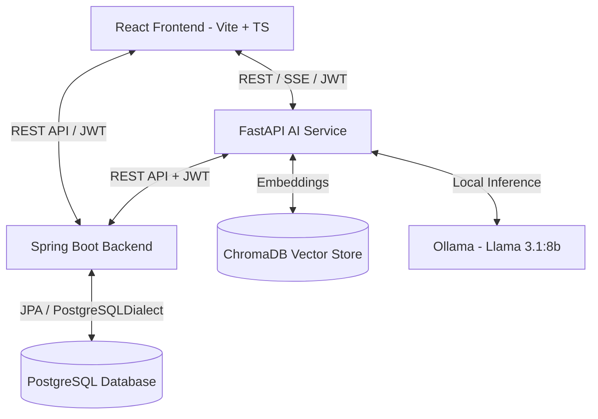
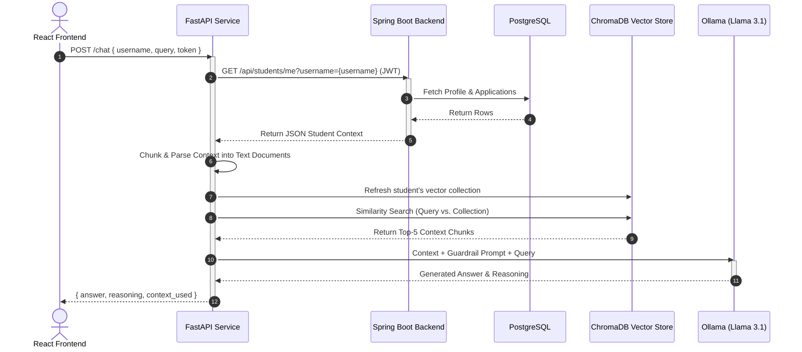

# NextGen.AI2.0 Placement Portal 🚀

An AI-powered campus placement management platform that combines a robust transactional backend with a local, privacy-first RAG-based career assistant — no external LLM API costs required.

## ✨ Overview

NextGen Placement Portal streamlines the campus recruitment process for **students** and **placement coordinators**. Beyond standard placement-tracking features (companies, applications, events, resources, notifications), it ships with an integrated AI chat assistant that gives students personalized guidance — e.g. *"Which companies should I focus on next based on my background?"* — using retrieval-augmented generation grounded in each student's own profile and application history.

## 🏗️ Architecture

The system is a **decoupled, multi-service architecture** separating UI, core business logic, and AI intelligence.



### Components

| Layer | Stack | Responsibility |
|---|---|---|
| **Frontend** | React + Vite + TypeScript | SPA UI, JWT session handling, SSE streaming for chat |
| **Backend** | Spring Boot + Spring Security | Controller-Repository-Model REST API, CRUD for companies/applications/events/notifications, BCrypt auth |
| **AI Service** | FastAPI + LangChain | Retrieval-Augmented Generation (RAG) career assistant |
| **Primary DB** | PostgreSQL | Relational storage — transactional data, audit trail |
| **Vector Store** | ChromaDB | Per-student embedded profile/application vectors |
| **LLM Runtime** | Ollama (`llama3.1:8b`, `nomic-embed-text`) | Fully local embeddings + inference — zero cloud API cost |

## 🗄️ Database Design

Relational model supports a multi-role workspace (Students & Coordinators).

- **`users`** — base credentials and role (`student` / `coordinator`)
- **`students`** — 1:1 with `users`; academic metrics (`cgpa`, `department`, `year`), contact details
- **`companies`** — recruiting companies on the portal
- **`applications`** — junction of `students` ↔ `companies`; status (`APPLIED`, `SHORTLISTED`, `NEXT_ROUND`, `SELECTED`, `REJECTED`), `package_lpa`, `next_action`
- **`on_duty_requests`** — approval requests for external recruitment drives
- **`events`** / **`resources`** — placement events and prep materials (linked to coordinator `users`)
- **`notifications`** — targeted student alerts

```
[users] 1───1 [students] 1───0..* [applications] 0..*───1 [companies]
   │              │                    │
   │              ├──0..* [on_duty]    │
   │              └──0..* [notify]     │
   │                                   │
   └──────── 0..* [events / resources]─┘
```

## 🤖 How the AI Chat Works



1. **Frontend Initiation** — React sends a POST to FastAPI (`/chat` or `/chat/stream`) with `username`, `query`, and JWT.
2. **Context Gathering** — FastAPI calls the Spring Boot API (using the relayed JWT) to fetch the student's profile, applications, events, and resources.
3. **Dynamic Vectorization** — Raw JSON is chunked into sentences, embedded via Ollama's `nomic-embed-text`, and loaded into a private ChromaDB collection (`student_{username}`), replacing any stale data.
4. **Context Retrieval** — Top-5 relevant chunks are pulled via similarity search against the query vector.
5. **LLM Synthesis** — Context + query + guardrail system prompt are sent to local `llama3.1:8b`.
6. **Delivery** — Response is returned as JSON or streamed via SSE for a real-time typing effect.

## 🔑 Key Highlights

- **Zero cloud/API overhead** — fully local LLM + embeddings via Ollama, no OpenAI/Anthropic API costs
- **Privacy-isolated RAG** — each student's vectors live in a dedicated collection; guardrails block cross-student data access
- **Separation of concerns** — Spring Boot for compiler-checked business logic, FastAPI for Python's AI/ML ecosystem
- **Real-time UX** — SSE streaming (`/chat/stream`) for token-by-token responses

## 📁 Project Structure

```
nextgen.ai/
├── backend/               # Spring Boot service
│   └── placementportal/
│       ├── controller/    # REST controllers (Student, Auth, ...)
│       ├── model/         # JPA entities
│       ├── config/        # Security config
│       └── resources/     # application.properties, schema.sql
├── ai-service/            # FastAPI RAG service
│   ├── main.py
│   └── student_rag.py
└── frontend/               # React + Vite + TS SPA
    └── src/
        └── pages/
```

## ⚙️ Getting Started

### Prerequisites
- Java 17+ and Maven
- Node.js 18+ and npm/yarn
- Python 3.10+
- PostgreSQL
- [Ollama](https://ollama.com) with `llama3.1:8b` and `nomic-embed-text` pulled

```bash
ollama pull llama3.1:8b
ollama pull nomic-embed-text
```

### 1. Backend (Spring Boot)
```bash
cd backend/placementportal
# configure src/main/resources/application.properties with your DB credentials
mvn spring-boot:run
```

### 2. AI Service (FastAPI)
```bash
cd ai-service
python -m venv venv && source venv/bin/activate   # Windows: venv\Scripts\activate
pip install -r requirements.txt
uvicorn main:app --reload --port 8001
```

### 3. Frontend (React + Vite)
```bash
cd frontend
npm install
npm run dev
```

### 4. Database
```bash
# Create the database, then run the schema
psql -U <user> -d <database> -f backend/placementportal/src/main/resources/schema.sql
```

## 🔐 Authentication
JWT-based auth via Spring Security, with BCrypt password hashing. The frontend attaches the JWT to both the Spring Boot API and the FastAPI AI service, which relays it onward for identity verification.

## 🛣️ Roadmap
- [ ] Role-based dashboards refinement
- [ ] Resume parsing → structured profile ingestion
- [ ] Coordinator analytics dashboard
- [ ] Email/SMS notification integrations


## 📄 License
Add your license here (e.g., MIT).
